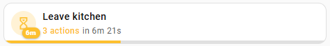
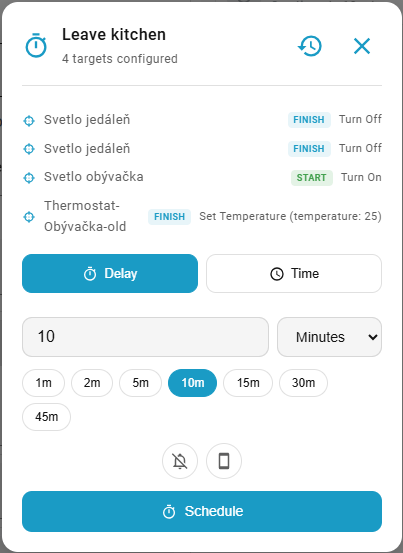
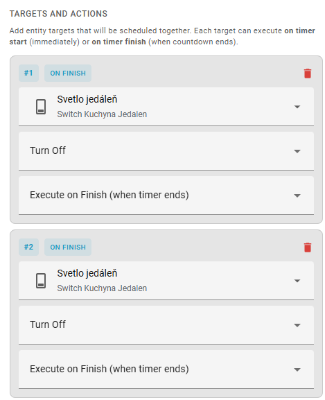
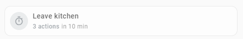

# Quick Timer

[](https://my.home-assistant.io/redirect/config_flow_start/?domain=quick_timer)
[](https://github.com/hacs/integration)
[](https://github.com/jozefnad/homeassistant-quick_timer/releases)
[](LICENSE)
<a href="https://www.buymeacoffee.com/jozefnad">
  
</a>

**Quick Timer** is an all-in-one custom integration for Home Assistant that lets you schedule one-time actions on any entity — complete with a built-in Lovelace card, visual countdown, progress bar, and multi-target support.

> The Lovelace card is **included** and registers automatically — no separate frontend installation required.

<p align="center">
  
</p>

---

### 📑 Quick Navigation

[Features](#-features) · [Installation](#-installation) · [Getting Started](#-getting-started) · [Card Configuration](#-card-configuration) · [Services](#-services) · [FAQ](#-faq) · [Troubleshooting](#-troubleshooting)

---

## ✨ Features

| | |
|---|---|
| ⏱️ **One-time scheduling** | Relative delay (seconds / minutes / hours) or absolute time (HH:MM) |
| 🎯 **Multi-target actions** | Control multiple entities with a single timer — `start_actions` run immediately, `finish_actions` run when the countdown ends |
| 🔧 **Dynamic service discovery** | The card auto-discovers available services and fields for each entity |
| 📊 **Progress bar** | Visual progress synced with the backend |
| 💾 **Persistent timers** | Tasks survive HA restarts; missed tasks execute on startup |
| 🔔 **Notifications** | HA persistent + targeted mobile push on completion |
| 🎨 **Built-in Lovelace card** | Compact & full modes, 24 colors, badge countdown, configurable interactions |
| 💉 **Dialog injection** | Quick Timer panel inside entity more-info dialogs |
| 📋 **Overview card** | Dashboard card listing all active timers |
| 🧠 **History presets** | Remembers last 3 configs per entity |
| 🆔 **Task isolation** | Multiple independent timers per entity via unique `task_id` |

---

## 📦 Installation

### HACS (Recommended)

1. Open **HACS** → **Integrations**
2. Menu (⋮) → **Custom repositories**
3. Add `https://github.com/jozefnad/homeassistant-quick_timer` • Category: **Integration**
4. Search **Quick Timer** → **Download**
5. **Restart** Home Assistant

### Manual

1. Download from [Releases](https://github.com/jozefnad/homeassistant-quick_timer/releases)
2. Copy `custom_components/quick_timer` to your `config/custom_components/`
3. **Restart** Home Assistant

> The Lovelace card resource registers automatically — no manual setup needed.

---

## 🚀 Getting Started

1. **Settings** → **Devices & Services** → **+ Add Integration** → **Quick Timer** → **Submit**
2. Add `custom:quick-timer-card` to any dashboard — it's available in the card picker immediately
3. Configure targets and timer defaults in the visual editor

<p align="center">
  <video src="images/screens/card_quick_visual.mp4" controls width="480"></video>
</p>

### Quick YAML Example

```yaml
type: custom:quick-timer-card
targets:
  - entity: light.living_room
    service: light.turn_off
    phase: finish
default_delay: 30
default_unit: minutes
mode: compact
```

### Time Presets

Customize time presets in **Settings** → **Devices & Services** → **Quick Timer** → **Configure** (comma-separated values for seconds, minutes, hours).

---

## 🎨 Card Configuration

The visual editor handles everything — just add the card and configure through the UI.

<p align="center">
  
  &nbsp;&nbsp;
  
</p>

<details>
<summary><strong>📋 Full Configuration Reference</strong></summary>

### Card Options

| Option | Type | Default | Description |
|--------|------|---------|-------------|
| `targets` | list | `[]` | Entity targets with service, data, and phase (`start` / `finish`) |
| `name` | string | *auto* | Card display name |
| `icon` | string | *auto* | Icon override |
| `color` | string | `state` | Icon color — `state`, `primary`, `accent`, or any of 24 named colors |
| `default_delay` | int | `15` | Default delay value |
| `default_unit` | string | `minutes` | `seconds` / `minutes` / `hours` |
| `default_time_mode` | string | `relative` | `relative` (delay) or `absolute` (specific time) |
| `default_at_time` | string | | Default absolute time (`HH:MM`) |
| `mode` | string | `compact` | `compact` (tile) or `full` |
| `show_badge` | bool | `true` | Countdown badge on icon |
| `show_progress_bar` | bool | `false` | Visual progress bar |
| `inactive_style` | string | `dim` | `none`, `dim`, or `grayscale` |
| `primary_info` | string | `name` | Top line: `name`, `state`, `last-changed`, `none` |
| `secondary_info` | string | `timer` | Bottom line: `timer`, `state`, `action`, `none` |
| `tap_action` | object | `toggle-timer` | `toggle-timer`, `settings`, `none` |
| `hold_action` | object | `settings` | Hold behavior |
| `icon_tap_action` | object | `settings` | Icon tap behavior |
| `notify_ha` | bool | `false` | HA persistent notification |
| `notify_devices` | list | `[]` | Mobile device IDs for push notifications |

### Target Object

| Field | Type | Description |
|-------|------|-------------|
| `entity` | string | Entity ID (`light.living_room`) |
| `service` | string | Service to call (`light.turn_off`) |
| `data` | object | Service data (`{ brightness: 128 }`) |
| `phase` | string | `finish` *(default)* — when timer ends / `start` — immediately |

</details>

### Multi-Target Example

Turn lights on immediately, turn everything off after 2 hours:

```yaml
type: custom:quick-timer-card
name: Movie Mode
default_delay: 2
default_unit: hours
show_progress_bar: true
targets:
  - entity: light.living_room
    service: light.turn_on
    data:
      brightness: 50
    phase: start
  - entity: media_player.tv
    service: media_player.turn_on
    phase: start
  - entity: light.living_room
    service: light.turn_off
    phase: finish
  - entity: media_player.tv
    service: media_player.turn_off
    phase: finish
```

### Overview Card

All active timers in one place:

```yaml
type: custom:quick-timer-overview-card
title: Active Timers
```

<p align="center">
  
</p>

---

## 🔧 Services

### `quick_timer.run_action`

Schedule a timer with immediate (start) and delayed (finish) actions.

```yaml
service: quick_timer.run_action
data:
  task_id: bedroom_lights_off
  delay: 30
  unit: minutes
  finish_actions:
    - service: light.turn_off
      target:
        entity_id: light.bedroom
  notify_ha: true
```

<details>
<summary><strong>📋 All Parameters</strong></summary>

| Parameter | Type | Required | Default | Description |
|-----------|------|----------|---------|-------------|
| `task_id` | string | ❌ | *auto* | Unique task identifier. Enables multiple timers per entity. |
| `finish_actions` | list | ✅ | | Actions when timer ends. Each: `{ service, target, data }` |
| `start_actions` | list | ❌ | | Actions executed immediately on start |
| `delay` | int | ✅* | `15` | Delay (1–86400). Required for relative mode. |
| `unit` | string | ❌ | `minutes` | `seconds`, `minutes`, `hours` |
| `time_mode` | string | ❌ | `relative` | `relative` or `absolute` |
| `at_time` | string | ❌ | | Target time (`HH:MM`). Required for absolute mode. |
| `task_label` | string | ❌ | | Label for overview card |
| `notify_ha` | bool | ❌ | `false` | HA notification on completion |
| `notify_mobile` | bool | ❌ | `false` | Push to all mobile devices |
| `notify_devices` | list | ❌ | | Specific device IDs |

</details>

<details>
<summary><strong>📝 More Examples</strong></summary>

**Absolute time:**

```yaml
service: quick_timer.run_action
data:
  task_id: night_routine
  time_mode: absolute
  at_time: "23:30"
  start_actions:
    - service: light.turn_on
      target:
        entity_id: light.hallway
      data:
        brightness: 30
  finish_actions:
    - service: light.turn_off
      target:
        entity_id: light.hallway
    - service: switch.turn_off
      target:
        entity_id: switch.tv_plug
```

**Multi-target with label and notifications:**

```yaml
service: quick_timer.run_action
data:
  task_id: movie_night
  task_label: "Movie Night"
  delay: 2
  unit: hours
  start_actions:
    - service: light.turn_on
      target:
        entity_id: light.living_room
      data:
        brightness: 50
    - service: media_player.turn_on
      target:
        entity_id: media_player.tv
  finish_actions:
    - service: light.turn_off
      target:
        entity_id: light.living_room
    - service: media_player.turn_off
      target:
        entity_id: media_player.tv
  notify_ha: true
```

</details>

### `quick_timer.cancel_action`

```yaml
service: quick_timer.cancel_action
data:
  task_id: bedroom_lights_off
```

<details>
<summary><strong>📋 Preferences Services</strong></summary>

### `quick_timer.get_preferences`

Retrieve saved preferences and history for an entity (or all entities if omitted).

| Parameter | Type | Required | Description |
|-----------|------|----------|-------------|
| `entity_id` | string | ❌ | Entity ID |

### `quick_timer.set_preferences`

Save preferences for an entity (used internally by the card).

| Parameter | Type | Required | Description |
|-----------|------|----------|-------------|
| `entity_id` | string | ✅ | Entity ID |
| `preferences` | object | ✅ | Preferences data |

</details>

---

<details>
<summary><h2>📊 Monitoring Sensor</h2></summary>

`sensor.quick_timer_monitor` provides real-time information about all active timers.

**State:** Number of active tasks.

| Attribute | Description |
|-----------|-------------|
| `active_tasks` | All tasks with `remaining_seconds`, `start_timestamp`, `end_timestamp` |
| `task_count` | Number of active tasks |
| `preferences` | Stored user preferences per entity |
| `presets` | Configurable time presets |

**Example automation:**

```yaml
trigger:
  - platform: numeric_state
    entity_id: sensor.quick_timer_monitor
    above: 0
action:
  - service: notify.mobile_app
    data:
      message: "You have {{ states('sensor.quick_timer_monitor') }} active tasks"
```

</details>

<details>
<summary><h2>📱 Events</h2></summary>

| Event | Key Data | Description |
|-------|----------|-------------|
| `quick_timer_task_started` | `task_id`, `finish_actions`, `delay_seconds` | Timer started |
| `quick_timer_task_completed` | `task_id`, `success_count`, `error_count` | Timer finished |
| `quick_timer_task_cancelled` | `task_id`, `reason` | Timer cancelled |

**Example automation:**

```yaml
trigger:
  - platform: event
    event_type: quick_timer_task_completed
action:
  - service: notify.mobile_app
    data:
      message: "Timer '{{ trigger.event.data.task_id }}' — {{ trigger.event.data.success_count }} actions done"
```

</details>

---

## ❓ FAQ

<details>
<summary><strong>Do I need to install the Lovelace card separately?</strong></summary>

No. The card is bundled and registers automatically. When you remove the integration, the resource is cleaned up too.
</details>

<details>
<summary><strong>Can I run multiple timers for the same entity?</strong></summary>

Yes. Each card generates a unique `card_id` used as `task_id`. Multiple cards targeting the same entity have fully independent timers.
</details>

<details>
<summary><strong>What happens after a Home Assistant restart?</strong></summary>

All tasks are persisted. On startup, pending tasks are restored. Expired tasks execute immediately.
</details>

<details>
<summary><strong>How does absolute time mode work?</strong></summary>

Set `time_mode: absolute` and `at_time: "HH:MM"`. If the time is in the past, it schedules for the next day.
</details>

<details>
<summary><strong>How are notifications delivered?</strong></summary>

- **`notify_ha`** — HA persistent notification
- **`notify_mobile`** — Push to all mobile devices
- **`notify_devices`** — Push to specific devices (uses `notify.send_message` first, falls back to `notify.mobile_app_*`)
</details>

---

## 🐛 Troubleshooting

| Problem | Solution |
|---------|----------|
| Card not in picker | Ensure the config entry exists, clear cache (Ctrl+F5), check browser console |
| Services not available | Check **Settings** → **Devices & Services** → **Quick Timer** is loaded |
| Timer didn't run after restart | Task must have `finish_actions`; check logs for "Executing missed task" |

---

## 🤝 Contributing

Contributions are welcome! Open an [issue](https://github.com/jozefnad/homeassistant-quick_timer/issues) or pull request.

---

<p align="center">
  <strong>Built with ❤️ in my spare time.</strong><br>
  If Quick Timer saves you time, consider buying me a beer — it keeps the motivation going!<br><br>
  <a href="https://www.buymeacoffee.com/jozefnad">
    
  </a>
</p>

<p align="center">
  ⭐ If you like this project, <a href="https://github.com/jozefnad/homeassistant-quick_timer">give it a star</a>!
</p>
